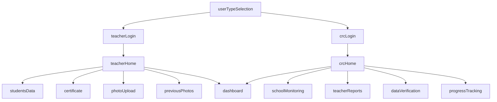

# HariHar Pathshala - Screen Architecture Documentation

## 📱 Screen Organization & Structure

### 🔐 **AUTHENTICATION SECTION**
Entry point और user authentication के लिए screens:

| Screen | Purpose | Users |
|--------|---------|-------|
| `userTypeSelection` | Main entry - Choose Teacher or CRC | All |
| `teacherLogin` | Teacher authentication | Teacher |
| `crcLogin` | CRC Supervisor authentication | CRC |

---

### 👨‍🏫 **TEACHER SECTION**
Teachers के लिए dedicated functionality:

| Screen | Purpose | Description |
|--------|---------|-------------|
| `teacherHome` | Teacher Dashboard | Main navigation hub for teachers |
| `studentsData` | Student Management | Manage student information & records |
| `certificate` | Certificate View | View existing certificates |
| `newCertificate` | Certificate Creation | Generate new certificates |
| `photoUpload` | Photo Upload | Upload school/activity photos |
| `newPhotoUpload` | New Photo Interface | Enhanced photo upload with preview |
| `previousPhotos` | Photo Gallery | View previously uploaded photos |

**Teacher Workflow:**
```
teacherLogin → teacherHome → [studentsData/certificate/photoUpload/previousPhotos]
```

---

### 👨‍💼 **CRC SUPERVISOR SECTION**
CRC Coordinators के लिए monitoring & management:

| Screen | Purpose | Description |
|--------|---------|-------------|
| `crcHome` | CRC Dashboard | Main navigation for CRC supervisors |
| `schoolMonitoring` | School Oversight | Monitor schools in CRC jurisdiction |
| `teacherReports` | Teacher Management | View & manage teacher reports |
| `dataVerification` | Data Validation | Verify and validate submitted data |
| `progressTracking` | Progress Analysis | Track educational progress metrics |

**CRC Workflow:**
```
crcLogin → crcHome → [schoolMonitoring/teacherReports/dataVerification/progressTracking]
```

---

### 🔄 **SHARED/COMMON SECTION**
Common functionality accessible by multiple user types:

| Screen | Purpose | Users |
|--------|---------|-------|
| `dashboard` | Common Analytics | Teacher & CRC |

---

## 🏗️ **Architecture Benefits**

### ✅ **Clear Separation of Concerns**
- **Authentication**: Isolated login flows
- **Teacher Features**: Student-centric functionality
- **CRC Features**: Administrative & monitoring tools
- **Shared**: Common utilities

### ✅ **Scalable Structure**
- Easy to add new screens in respective sections
- Clear navigation paths
- Role-based access control

### ✅ **Maintainable Code**
- Logical grouping in imports
- Section-wise organization
- Clear documentation

---

## 🚀 **Navigation Flow**



---

## 📋 **Implementation Status**

| Section | Screens | Status | Features |
|---------|---------|--------|----------|
| **Authentication** | 3 | ✅ Complete | Login validation, user type selection |
| **Teacher** | 7 | ✅ Complete | Student mgmt, certificates, photos |
| **CRC** | 5 | ✅ Complete | School monitoring, reports, verification |
| **Shared** | 1 | ✅ Complete | Common dashboard |

**Total: 16 Screens - All Functional** 🎉

---

## 🔧 **Technical Implementation**

### File Structure:
```
lib/src/
├── navigation/
│   └── app_navigator.dart          # Section-wise navigation
├── providers/
│   └── app_state_provider.dart     # Organized AppScreen enum
└── screens/
    ├── user_type_selection_screen.dart    # Auth
    ├── teacher_login_screen.dart           # Auth
    ├── crc_login_screen.dart              # Auth
    ├── teacher_home_screen.dart            # Teacher
    ├── students_data_screen.dart           # Teacher
    ├── certificate_screen.dart             # Teacher
    ├── new_certificate_screen.dart         # Teacher
    ├── photo_upload_screen.dart            # Teacher
    ├── new_photo_upload_screen.dart        # Teacher
    ├── previous_photos_screen.dart         # Teacher
    ├── crc_home_screen.dart               # CRC
    ├── school_monitoring_screen.dart       # CRC
    ├── teacher_reports_screen.dart         # CRC
    ├── data_verification_screen.dart       # CRC
    ├── progress_tracking_screen.dart       # CRC
    └── dashboard_screen.dart               # Shared
```

### Navigation Logic:
- **Role-based routing**: Different flows for Teacher vs CRC
- **Stack management**: Proper back navigation
- **State persistence**: User session maintained
- **Section isolation**: Clear boundaries between user types

---

**Generated on:** July 22, 2025  
**App Version:** HariHar Pathshala Flutter v1.0  
**Status:** Production Ready ✅
